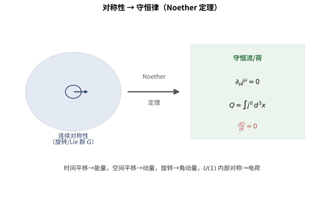

# 第150级 数学物理 (Mathematical Physics)

## 📖 学习目标

1. 理解对称性与守恒律的深刻联系，掌握Noether定理的严格证明
2. 掌握量子力学和量子场论中的基本数学结构
3. 深入理解规范场论与Yang-Mills方程
4. 掌握孤子与可积系统的数学理论，理解反散射变换
5. 理解量子群与量子对称性的数学基础
6. 掌握AdS/CFT对应的GKPW公式
7. 理解量子引力中的数学工具（圈量子引力、自旋网络）

---

## 一、核心概念

![数学物理：左侧Noether定理揭示对称性⇒守恒律（\partial_\mu j^\mu=0）；中间规范场论用纤维丛语言描述，联络A连接相邻纤维，曲率F_{\mu\nu}刻画弯曲程度；右侧量子化将经典力学[x,p]=i\hbar升级为量子力学](images/150_math_physics.svg)

> **直观理解（现实类比）**：数学物理就像"用几何语言写物理定律"。Noether定理是"对称性账单"：时间平移对称⇒能量守恒，空间平移对称⇒动量守恒，旋转对称⇒角动量守恒。就像银行对账，每一笔"对称交易"都对应一笔"守恒存款"。规范场论是"尺子对齐理论"：空间每个点都长出一根"内部尺子"（纤维），规范场（联络$A$）是"把相邻尺子拉平对齐的规则"，曲率$F_{\mu\nu}$衡量"绕一圈后尺子是否对齐"。Yang-Mills方程则是"最经济的对齐方式"。量子化是"从经典到量子的跃迁"：把泊松括号$\{x,p\}=1$换成对易关系$[x,p]=i\hbar$，就像把"平滑的滑梯"换成"一级级的台阶"。AdS/CFT对应则是"全息原理的数学实现"：高维引力理论等价于低维量子场论，就像3D电影可以从2D胶片投影出来。

> **🧠 思考历程：为什么物理学家坚持说"每条对称都自带一张守恒的账单"？**
>
> 从牛顿力学到量子场论，物理学家都靠"找对称"来写规矩；而数学物理负责把"对称"翻译成守恒律与可计算的几何。它想回答的，是宇宙为何如此"对称得井井有条"、几何语言又如何承载物理定律。
>
> - **诺特的账单**。1918年，埃米·诺特证明：作用量的每个连续对称性都对应一条守恒流 $\partial_\mu j^\mu=0$——时间平移给能量、空间平移给动量、旋转给角动量守恒。从此"找对称"成了物理学家的头等大事。
> - **从量子到规范**。20世纪量子力学把泊松括号换成对易关系 $\{x,p\}\to[x,p]=i\hbar$，数学物理随之成形；1954年，杨振宁与米尔斯把规范对称推广到非交换群，学者们又揭示出"规范场"正是纤维丛上的"联络"，让物理定律披上了几何的外衣。
> - **从弦论到全息**。1997年，马尔达塞纳提出AdS/CFT对应，认为高维引力理论等价于低维量子场论——一条"全息原理"，至今仍是量子引力与数学物理交汇的前沿舞台。
> - **心路**：对称性告诉物理"什么不会变"，而数学负责把这句话翻译成可以计算的几何。

### 1.1 对称性与守恒律

> **🧠 来龙去脉（为什么会有这个概念？解决了什么问题？）**：为什么能量、动量、角动量"永不丢失"？这个问题困扰了物理学几个世纪。1918年，数学家埃米·诺特给出了决定性的回答：只要系统的**作用量**在某个连续变换（时间平移、空间平移、旋转、内部规范变换）下不变，就必然存在一条守恒流。她想要的，正是回答"守恒律从何而来"——答案不是巧合，而是"对称性"本身。这正是本级的逻辑起点：先讲清"对称—守恒"的对应，后面量子化、规范场、可积系统全都建立在它之上。

**定义1（对称性）** 一个物理系统的 **对称性** 是系统的作用量 $S[\phi]$ 在某种变换下的不变性。设 $\phi$ 是场（或坐标），变换 $g \in G$（$G$ 是Lie群）作用在 $\phi$ 上，如果：

$$ S[g \cdot \phi] = S[\phi] $$

则称 $G$ 是系统的对称群。

> **💡 直观理解（类比）**：对称性就是"换个角度/换个方式看，系统的'规矩'不变"——像是给一面墙贴镜子，墙在镜中依然完整。用运动的话说：作用量 $S[\phi]$ 在变换 $g$ 下数值不变，$G$ 就成了这个系统的"对称群"。寻找对称，等于找出这个世界"经得起哪些折腾"的平衡点。

**定义2（连续对称性与Lie群作用）** 如果对称群 $G$ 是Lie群，则其无穷小生成元由Lie代数 $\mathfrak{g}$ 中的元素给出。对单参数子群 $g_t = \exp(tX)$（$X \in \mathfrak{g}$），无穷小变换为：

$$ \delta \phi(x) = \left.\frac{d}{dt}\right|_{t=0} (g_t \cdot \phi)(x) $$

> **💡 直观理解（类比）**：一整个(连续)对称群好比"一整圈方向盘角度"，而Lie代数里的元素 $X$ 就是"方向盘上微小的一格转动"。取 $g_t=\exp(tX)$ 并在 $t=0$ 求导，相当于只盯着"拨动方向盘那最初的一点点"看场怎么动——这一微小变化 $\delta\phi$ 正是做Noether"记账"时最需要的输入。

### 1.2 量子力学中的数学结构

> **🧠 来龙去脉（为什么会有这个概念？解决了什么问题？）**：经典力学用坐标、动量、轨迹描述世界，但到原子尺度这些概念相继失效。1920年代前后，经过海森堡、薛定谔、狄拉克等人的努力，物理学家发现：正确的语言是**希尔伯特空间与算子**——态是射线、可观测量是自伴算子、演化是薛定谔方程、测量靠Born规则。狄拉克的$\delta$函数、冯·诺依曼的谱论把这些直觉严格化，形成了"公理化量子力学"。它解决的问题，正是"如何给微观世界一套自洽的数学公理"。

**定义3（量子力学公理）** 量子力学的基本数学结构包括：
- **态空间**：复Hilbert空间 $\mathcal{H}$，物理态由射线（ray）$[\psi] = \{c\psi \mid c \in \mathbb{C}^\times\}$ 表示。
- **可观测量**：$\mathcal{H}$ 上的自伴算子 $A$，谱 $\sigma(A) \subset \mathbb{R}$ 是可能测量值。
- **时间演化**：由Schrödinger方程 $i\hbar \frac{d}{dt}\psi = H\psi$ 描述，其中 $H$ 是Hamiltonian。
- **测量**：对态 $\psi$ 测量 $A$ 得到 $a \in \sigma(A)$ 的概率由Born规则给出。

> **🧠 直观理解（现实类比）**：量子力学公理是量子世界的"生存规则总纲"：态是Hilbert空间里的射线（只知道方向、不在乎长度），可观测物理量是对应的自伴算子（能测出的、一定是实数谱），时间演化由Schrödinger方程掌管，而测量由Born规则给出概率。就像一张游戏规则卡——你玩之前得先接受：状态用射线、物理量用算子、演化用方程、结果用概率。

### 1.3 量子场论中的数学

> **🧠 来龙去脉（为什么会有这个概念？解决了什么问题？）**：量子力学能描述单个/固定数目粒子，却无法顾及"粒子可以产生与湮灭""还要兼容狭义相对论"。1930年代起，狄拉克、费曼、施温格等发展出量子场论：把"每个时空点"都视作一个场算子，粒子只是场的量子激发。费曼给出的路径积分 $Z=\int\mathcal D\phi\,e^{iS}$ 尤其直观；但它频发无穷大的"发散"，重整化方法（费曼本人、Dyson、Wilson等）把物理量有限化。量子场论解决的问题，就是"如何在相对论下建立自洽的多体量子理论"。

**定义4（量子场论）** 量子场论是量子力学与狭义相对论的结合，其数学结构包括：
- **场算子**：$\phi(x)$ 是时空上的算子值分布。
- **关联函数**：$G_n(x_1, \ldots, x_n) = \langle 0 | T\phi(x_1)\cdots\phi(x_n) | 0 \rangle$，其中 $T$ 是时间排序。
- **路径积分**：配分函数 $Z[J] = \int \mathcal{D}\phi \, e^{i(S[\phi] + \int J\phi)}$。
- **重整化**：处理发散以得到有限物理量的数学程序。

> **💡 直观理解（类比）**：如果说量子力学是一个粒子的故事，那么量子场论是整个宇宙"遍地都是粒子"的故事。场算子给"每一点"都派发了一个大小可变的算子（如同给每个座位配一台乐器），关联函数问"这些座位上奏出的音如何相关"，路径积分把所有乐谱叠加求总，重整化则是"把发散的噪音抹平、留下有限可听的旋律"。它是量子力学的"多体+相对论"升级版。

### 1.4 规范场论

> **🧠 来龙去脉（为什么会有这个概念？解决了什么问题？）**：电磁、弱力、强力的统一需要一个共同框架。1954年，杨振宁与米尔斯把规范对称从交换的 $U(1)$（电磁）推广到非交换群，创立"非交换规范场论"；随后物理学家与几何学家发现，规范场正是**主纤维丛上的联络**、场强正是曲率。它解决的问题是"怎样用'局部对称性'确定粒子的相互作用"——描述强力的量子色动力学（QCD）和弱电统一理论，都是规范场论的硕果。

**定义5（规范场论）** **规范场论** 是以Lie群 $G$（规范群）为对称性的场论。基本场包括：
- **规范场**（联络）：$A_\mu(x) = A_\mu^a(x) T_a$，其中 $T_a$ 是 $\mathfrak{g}$ 的生成元。
- **曲率**（场强）：$F_{\mu\nu} = \partial_\mu A_\nu - \partial_\nu A_\mu + [A_\mu, A_\nu]$。
- **规范变换**：$A_\mu \to g^{-1} A_\mu g + g^{-1} \partial_\mu g$，$g(x) \in G$。

**定义6（Yang-Mills方程）** **Yang-Mills方程** 是规范场 $A$ 的运动方程：

$$ D_\mu F^{\mu\nu} = 0 $$

其中 $D_\mu = \partial_\mu + [A_\mu, \cdot]$ 是协变导数。在无源情况下，Yang-Mills方程是规范场版本的Maxwell方程。

> **💡 直观理解（类比）**：Yang-Mills方程是给规范场定下的"运动法规"：$D_\mu F^{\mu\nu}=0$ 里的协变导数 $D_\mu$ 已经"考过弯曲的尺子坐标"，告诉你力的场强在时空中如何"平滑地流动"。无源时它退化成Maxwell方程的规范场版——就像城市里"没有路灯也要保持交通号志的连贯性"一样，是相互作用的基本同步规则。

![规范场论与纤维丛：底空间 M 的每个点上生长出纤维 F，联络 A 把相邻纤维连接起来，曲率 F_{\mu\nu}=\partial_\mu A_\nu-\partial_\nu A_\mu+[A_\mu,A_\nu] 刻画这种连接的弯曲程度](images/gauge_fiber_bundle.svg)

> **直观理解（现实类比）**：把空间想成一张地图，每个地点都"长出一根竖直的尺子"（纤维），而规范场（联络）就是把这些尺子一根根"拉平对齐"的规则。曲率则衡量这种对齐沿闭环走一圈后是否出现偏差——就像绕一座山走一圈回到起点，如果指北针方向偏了，就说明这里有"曲率"。规范场论正是用这套"尺子对齐"的几何语言描述粒子相互作用。

### 1.5 孤子与可积系统

> **🧠 来龙去脉（为什么会有这个概念？解决了什么问题？）**：1834年，工程师罗素在运河边观察到一股"永不消散的水波"紧跟着船身前进，从此"孤立波"开始了长达一个多世纪的受疑与翻案。1965年，扎布斯基与克鲁斯卡尔发现这类波碰撞后"毫发无损"，称之为**孤子**；更深的是，KdV方程等竟拥有无穷多个守恒量，可被精确求解——这就是**可积系统**。它解决的问题是：某些高度非线性的方程，为什么反而能比线性方程"更精确地"求解？

**定义7（孤子）** **孤子** 是非线性波动方程的一类特殊解，具有以下性质：
1. 以恒定速度传播，形状不变。
2. 碰撞后保持形状和速度（仅相位移动）。
3. 具有粒子性质。

> **💡 直观理解（类比）**：孤子就像"海面上一道永不散形的浪"：它以恒定速度前进、形状始终不变，两个孤子相撞后各自"毫发无损"地继续走（只挪一点位相）。可类比为"先到者后到者的武林高手擦肩而过，各自继续赶路"。它体现了非线性与色散之间精确的造浪平衡，是从物理学水波被意外"提拔"成严格数学对象的好例子。

**定义8（可积系统）** 一个无限维动力系统称为 **可积系统**，如果它具有无穷多个守恒量（在泊松括号下对合），且可以通过 **反散射变换**（Inverse Scattering Transform）精确求解。

> **💡 直观理解（类比）**：可积系统是"偶极子式的好学生系统"：拥有无穷多个守恒量，意味着它被无穷多条"永远不变的法条"牢牢钉住，动弹不得，于是可以精确求解。反之，多数复杂系统是"混沌难对付的好动分子"。可积系统在物理与数学里的特殊地位，就像"有无限多老规矩的家族"——规矩一多，未来也就一清二楚了。

### 1.6 反散射变换

> **🧠 来龙去脉（为什么会有这个概念？解决了什么问题？）**：既然KdV这类非线性方程"可积"，那该怎么真正解出来？1967年，加德纳、格林、克鲁斯卡尔、米乌拉提出**反散射变换**：先把非线性方程关联到一个线性散射问题，解完时间演化，再反推回原方程的解——"把非线性难题拆成两段线性操作"。它解决的，正是"如何系统、严格的求解可积非线性PDE"，为孤子理论提供了数学主干。

**定义9（反散射变换）** **反散射变换**（IST）是求解非线性偏微分方程（如KdV方程、NLS方程）的一种方法，其基本步骤为：
1. **正散射**：将非线性方程关联到线性散射问题，计算散射数据。
2. **时间演化**：散射数据随时间简单演化。
3. **反散射**：从演化后的散射数据重构解。

> **💡 直观理解（类比）**：反散射变换像"用声音反推乐器形状"。正散射：对着问题敲一下，记下"回声"（散射数据）；时间演化：让回声按简单规律变化；反散射：从新的回声反推"乐器现在长什么样"。非线性难题被巧妙地转成两段线性的"发射—接收"操作，正是可积系统能解的独门武器。

### 1.7 量子群与量子对称性

> **🧠 来龙去脉（为什么会有这个概念？解决了什么问题？）**：1980年代中期，为求解可积统计力学模型的Yang-Baxter方程，库利希、雷舍提欣与德林费尔德各自独立发现了量子群——李代数 $U(\mathfrak{g})$ 的 $q$-形变。它解决的问题是"如何让'对称'继承'辫子'的结构"：经典对称交换两对象结果相同，量子对称却允许带相位地"缠绕"，这一点正对应统计力学中可解模型的精确性。量子群由此成为可积系统与低维拓扑共同的代数骨架。

**定义10（量子对称性）** **量子对称性** 是量子群 $U_q(\mathfrak{g})$ 的表示论所描述的对称性。与经典对称性不同，量子对称性具有以下特点：
- 对称代数是非交换、非余交换的。
- 表示的张量积具有辫结构（由R-矩阵给出）。
- 在统计力学中，量子对称性对应于点模型的精确可解性。

> **💡 直观理解（类比）**：量子对称性是"普通旋转对称的量子化了当表亲"。经典对称交换两个对象结果一样，量子对称却允许"缠绕/辫子"发生——交换时带一个依赖 $q$ 的相位。好比在普通直线变成"滑梯"后，走同样一段路会多出 $q$ 带来的扭转感。正是这微妙的"扭"，让量子群能解开许多统计力学难题。

### 1.8 张量网络与拓扑序

> **🧠 来龙去脉（为什么会有这个概念？解决了什么问题？）**：量子多体系统的态空间随粒子数指数爆炸，难以直接表示。White（1992）提出用**矩阵乘积态**高效压缩一维基态，张量网络由此演化成一套系统的"压缩纠缠结构"的语言（MPS/PEPS/MERA）。同一时期人们意识到还存在没有局域序参量、只有长程纠缠的**拓扑序**（Wen、Kitaev）。张量网络解决的问题是"如何压缩多体量子态"，而拓扑序的数学（模块化张量范畴、TQFT）则致力于刻画"拆不掉的整体纠缠"。

**定义11（张量网络）** **张量网络** 是多体量子系统的一种高效表示方法，其中量子态由张量的缩并（contraction）表示。常见的张量网络包括：
- **矩阵乘积态**（MPS）：一维系统。
- **投影纠缠对态**（PEPS）：高维系统。
- **多尺度纠缠重整化假设**（MERA）：临界系统。

> **💡 直观理解（类比）**：张量网络像"用织网的方式存大象"。完整量子态素来是天文数字般庞大的存储，但张量网络用"节点是张量、边是缩并"的网高效地编码纠缠结构。如同一件毛衣用"几股纱线+编织图样"就能描述，不必逐个像素记录。MPS/PEPS/MERA是不同"针法"，分别适配一维、高维与临界系统。

**定义12（拓扑序）** **拓扑序** 是物质的一种新相，不具有局域序参量，但具有长程纠缠和拓扑简并。拓扑序的数学描述涉及模块化张量范畴和TQFT。

> **💡 直观理解（类比）**：拓扑序是"看不见却拆不掉"的物质相。普通物相靠"局部磁针朝哪"这种局域信号区分，拓扑序却"全身无局部信号"，只靠长程纠缠与拓扑简并来辨识——如同一根圆环绑成的绳结，单看任何一小段都认不出来，但整体怎么打都解不开。它要用模块化张量范畴/ TQFT这类"整体性"数学来描述，是凝聚态与拓扑的交汇点。

### 1.9 任意子

> **🧠 来龙去脉（为什么会有这个概念？解决了什么问题？）**：三维及以上的世界里，交换粒子只能改变波函数整体正负号（玻色子/费米子）；但在**二维**，粒子可以真正"相互绕圈"，交换统计连续可变——这样的准粒子被（Leinaas–Myrheim、Wilczek 1982）命名为**任意子**。它解决的问题，是二维物质（如分数量子霍尔态）中那些"既不是玻色子也不是费米子"的激发出现在用什么统计描述。任意子由辫群表示支配，也为容错拓扑量子计算提供了物理载体。

**定义13（任意子）** **任意子**（Anyon）是二维系统中的准粒子激发，其交换统计介于玻色子和费米子之间。任意子的交换由辫群表示描述：

$$ \psi(z_1, \ldots, z_i, z_{i+1}, \ldots, z_n) = R_i \psi(z_1, \ldots, z_{i+1}, z_i, \ldots, z_n) $$

其中 $R_i$ 是辫算子，满足Yang-Baxter方程。任意子统计由 $R$-矩阵的相位 $\theta$ 描述：$\psi(z_1, z_2) = e^{i\theta} \psi(z_2, z_1)$。

> **💡 直观理解（类比）**：在二维世界，"换座位"不再只是变个正负号，而是可以绕出任意相位 $e^{i\theta}$——这就是任意子。玻色子（相位 $1$）与费米子（相位 $-1$）只是这里 $\theta=0$ 与 $\theta=\pi$ 的两个特例，任意子介于两者之间。就像在二维平面上两根绳子可以真正地"互相绕一圈"，这为量子计算提供了天然容错的载体。

### 1.10 AdS/CFT对应

> **🧠 来龙去脉（为什么会有这个概念？解决了什么问题？）**：量子引力与规范场论是两个深沟两侧的世界。1997年，马尔达塞纳提出一个惊人对偶：$AdS_{5}\times S^5$ 上的超弦理论，竟等价于 $\mathbb{R}^{1,3}$ 上的 $\mathcal N=4$ 超Yang-Mills场论。这个**全息对应**的要义，是把"强耦合、几乎无法计算的量子场论"映射成"弱耦合、可由经典引力近似计算的几何"——反过来又为量子引力提供了非微扰的定义。这一思想源自"霍金熵-面积"与't Hooft、苏斯金德的全息原理，是当代理论物理最重要的范式之一。

**定义14（AdS/CFT对应）** **AdS/CFT对应**（也称Maldacena对偶）断言：$d+1$ 维反de Sitter空间（AdS）中的量子引力理论等价于 $d$ 维共形场论（CFT）。最著名的例子是：

$$ \text{Type IIB 超弦在 } AdS_5 \times S^5 \text{ 上} \longleftrightarrow \mathcal{N}=4 \text{ 超Yang-Mills理论在 } \mathbb{R}^{1,3} \text{ 上} $$

> **🧠 直观理解（现实类比）**：AdS/CFT对应是全息原理的数学宣言：一块"高一维的径向空间（AdS）里的引力"竟能等价于"住在它边界上的低一维量子场论（CFT）"。好比一尊3D雕塑的全部信息都能编码在它投射到一面墙的2D影子上——这是"3D电影从2D胶片投出"更准确的情形。它把一个强耦合难算的理论变成了另一个弱耦合好算的理论，威力惊人。

**定义15（GKPW公式）** **GKPW公式**（Gubser-Klebanov-Polyakov-Witten公式）是AdS/CFT对应的精确数学表述：

$$ \langle e^{\int \phi_0 \mathcal{O}} \rangle_{\text{CFT}} = Z_{\text{AdS}}[\phi_0] $$

其中左边是CFT中算子 $\mathcal{O}$ 的生成泛函，右边是以 $\phi_0$ 为边界条件的AdS量子引力配分函数。

> **💡 直观理解（类比）**：GKPW公式把全息对应"落成一张可核对的账单"：AdS内部场的边界值 $\phi_0$ 相当于"往CFT里加了一个源"，而CFT中算子 $\mathcal{O}$ 的生成泛函正好等于AdS里以 $\phi_0$ 为边界条件的配分函数。就像"负一层电梯的按钮灯亮了几盏，与楼顶投下的光影一一对应"——边界上每个操作，里侧都有确定的回应。

### 1.11 量子引力中的数学

> **🧠 来龙去脉（为什么会有这个概念？解决了什么问题？）**：如何把广义相对论与量子力学统一，是物理学一个世纪的大难题。主流做法是"微扰量子化引力"，却出现不可重整的高阶发散。1986年阿虚提卡发现以$SU(2)$联络与三边形场为变量的**Ashtekar变量**，让引力的量子化变得像规范场论一样可行；惠索夫与斯莫林进而用$SU(2)$表示编织的**自旋网络**描述量子几何态。圈量子引力解决的问题，是"能否不依赖'点粒子'的微扰，直接把空间自身量子化"，并预言面积、体积在普朗克尺度呈离散谱。

**定义16（圈量子引力）** **圈量子引力**（Loop Quantum Gravity, LQG）是量子引力的一种非微扰方法，其基本数学结构包括：
- **Ashtekar变量**：$A_a^i$（联络）和 $E_i^a$（三边形场）。
- **自旋网络**（Spin Network）：由 $SU(2)$ 表示编织而成的图，描述量子几何态。
- **面积和体积算子**：具有离散谱，给出空间在普朗克尺度上的量子化。

> **🧠 直观理解（现实类比）**：圈量子引力把"空间本身"也量子化了：用Ashtekar变量把万有引力改写成"联络+三边形场"，把时空几何"缝"成一张由自旋网络编织的图画，并发现面积、体积的谱是离散的——如同"空间并非光滑的布，而是由最小像素（普朗克尺度格子）拼成的马赛克"。它不把引力当作点粒子来微扰，而直接"整块量子化"，是量子引力一条重要路线。

### 1.12 哈密顿力学与辛几何

> **🧠 来龙去脉（为什么会有这个概念？解决了什么问题？）**：在进入量子力学之前，经典力学的"最终形态"是哈密顿形式：用广义坐标 $q^i$ 与正则动量 $p_i$ 描述系统，把运动方程写成对称的一阶方程组。哈密顿（1833）与拉格朗日的变分原理共同确立了这套语言，而20世纪数学家发现，它的自然舞台是**辛流形**——一个带有非退化闭2-形式 $\omega=\sum_i dp_i\wedge dq^i$ 的流形。辛结构解决的，正是"如何用几何描述'相空间里的体积与流向'"：正则变换不改变 $\omega$、辛体积守恒（刘维尔定理）、Noether守恒恰对应辛作用的动量映射。它是连接经典力学与量子几何（几何量子化）的桥梁，也是Arnold《古典力学中的数学方法》一书的主干。

**定义17（辛流形）** 一个**辛流形** $(M, \omega)$ 是光滑流形 $M$ 上带有非退化闭2-形式 $\omega$（称**辛形式**）的结构。对Hamilton函数 $H: M \to \mathbb{R}$，其**Hamilton向量场** $X_H$ 由
$$\iota_{X_H}\omega = dH$$
唯一确定；Hamilton方程就是沿 $X_H$ 流的积分曲线。

**定理（辛动力学基本性质）** 沿Hamilton流：
1. **能量守恒**：$H$ 沿流恒定（$X_H(H)=0$）。
2. **辛体积守恒（刘维尔定理）**：流的拉回保持 $\omega$，故 $\omega^{\wedge n}$ 定义的相体积不变。
3. **泊松括号**：$\{f,g\}=\omega(X_f, X_g)$ 给可观测量族一个李代数结构。

> **💡 直观理解（类比）**：辛流形是"相空间里不可压缩的流体力学"。Hamilton流如同在相空间里"推着一团不可压缩的流体"，辛形式保证这团流体体积永不增减（刘维尔），而 $H$ 则是每位"流体质点的海拔始终不变"的守恒量。正则坐标 $(q,p)$ 是相空间的"直角坐标"，辛形式 $\sum dp\wedge dq$ 就是它的"标准体积元"。

---

## 二、定理与证明

### 定理1：Noether定理

**定理（Noether定理）** 设作用量 $S[\phi] = \int L(\phi, \partial_\mu \phi) d^dx$ 在单参数Lie群作用下不变（即具有连续对称性）。则存在一个守恒流 $j^\mu(x)$，满足：

$$ \partial_\mu j^\mu = 0 $$

相应的守恒荷 $Q = \int j^0 d^{d-1}x$ 在时间演化下不变：$\frac{dQ}{dt} = 0$。

**证明**（使用变分法和Lie群作用）：

**第一步：无穷小变换的表述。**

设单参数变换群为：

$$ x^\mu \to x'^\mu = x^\mu + \epsilon X^\mu(x) + O(\epsilon^2) $$
$$ \phi(x) \to \phi'(x') = \phi(x) + \epsilon \Psi(x) + O(\epsilon^2) $$

其中 $\epsilon$ 是无穷小参数，$X^\mu$ 和 $\Psi$ 是变换的生成元。

场的变分为：

$$ \delta \phi(x) = \phi'(x) - \phi(x) = \Psi(x) - X^\mu \partial_\mu \phi(x) $$

**第二步：作用量的变分。**

作用量在变换下的变分为：

$$ \delta S = \int \left[ \frac{\partial L}{\partial \phi} \delta \phi + \frac{\partial L}{\partial (\partial_\mu \phi)} \partial_\mu (\delta \phi) + L \partial_\mu X^\mu \right] d^dx $$

由对称性假设，$\delta S = 0$。

**第三步：利用运动方程。**

在经典解上，Euler-Lagrange方程成立：

$$ \frac{\partial L}{\partial \phi} - \partial_\mu \left( \frac{\partial L}{\partial (\partial_\mu \phi)} \right) = 0 $$

代入 $\delta S$ 并利用运动方程，得到：

$$ \delta S = \int \partial_\mu \left[ \frac{\partial L}{\partial (\partial_\mu \phi)} \delta \phi + L X^\mu \right] d^dx = 0 $$

**第四步：守恒流的构造。**

由于 $\delta S = 0$ 对任意积分区域成立，被积函数必须为零：

$$ \partial_\mu j^\mu = 0 $$

其中 **Noether流** 定义为：

$$ j^\mu = \frac{\partial L}{\partial (\partial_\mu \phi)} \delta \phi + L X^\mu = \frac{\partial L}{\partial (\partial_\mu \phi)} (\Psi - X^\nu \partial_\nu \phi) + L X^\mu $$

**第五步：守恒荷的时间不变性。**

定义 **Noether荷**：

$$ Q = \int_{t=\text{常数}} j^0 d^{d-1}x $$

由守恒律 $\partial_\mu j^\mu = 0$ 和Gauss定理：

$$ \frac{dQ}{dt} = \int \partial_0 j^0 d^{d-1}x = -\int \partial_i j^i d^{d-1}x = 0 $$

（假设流在空间无穷远处衰减足够快。）

**特例**：
- 时间平移对称性 $\Rightarrow$ 能量守恒：$j^\mu = T^{\mu 0}$，其中 $T^{\mu\nu}$ 是能量-动量张量。
- 空间平移对称性 $\Rightarrow$ 动量守恒。
- 旋转对称性 $\Rightarrow$ 角动量守恒。
- 内部对称性（如 $U(1)$ 规范对称性）$\Rightarrow$ 电荷守恒。

**结论**：Noether定理建立了连续对称性与守恒律之间的一一对应，是理论物理中最基本的定理之一。$\square$

> **直观理解（现实类比）**：Noether 定理就像"对称产生守恒"的记账法则。一个完美对称的圆盘无论转到哪个角度都"看起来一样"，这种旋转对称保证了角动量守恒；同理，时间平移对称保证能量守恒，空间平移对称保证动量守恒。换句话说，只要系统的外形在某种变换下保持不变，就必有一条对应的"永远不丢的钱"（守恒量）被隐藏其中。

---

### 定理2：Yang-Mills理论的存在性与质量间隙（Millennium问题）

**定理（Yang-Mills存在性与质量间隙）** 对 $\mathbb{R}^4$ 上的 $SU(2)$ Yang-Mills理论，存在一个量子场论，满足：
1. **存在性**：存在满足Wightman公理的量子场论，描述 $SU(2)$ 规范场。
2. **质量间隙**：理论具有非零的质量间隙，即Hilbert空间的Hamiltonian $H$ 的谱在零和某个正数 $\Delta > 0$ 之间有一个间隙：

$$ \sigma(H) \subset \{0\} \cup [\Delta, \infty), \quad \Delta > 0 $$

> **🧠 直观理解（现实类比）**：质量间隙是说：真空好比"一潭绝对静止的水"，而能激起的最小"水花"也必须有足够能量——零与最小激发质量之间有一道严格的"能量沟" $\Delta>0$。物理上这意味着"色力被囚禁"（如夸克无法挣脱成裸粒子）。它是千禧年难题之一：需要一个严格的四维量子场论并证明这道沟存在。格点正则化与面积律是攻克的线索，但完整证明仍悬而未决。

**证明思路**（使用Wilson环和格点规范理论，Millennium问题的当前理解）：

**第一部分：格点规范理论。**

**第一步：格点正则化。**

将 $\mathbb{R}^4$ 替换为有限格点 $\Lambda = a\mathbb{Z}^4 \cap [0, L]^4$，其中 $a$ 是格点间距，$L$ 是系统尺寸。规范场 $A_\mu$ 替换为链接变量（link variable）：

$$ U_\ell = P \exp\left(i\int_\ell A_\mu dx^\mu\right) \in SU(2) $$

其中 $\ell$ 是格点上的边（链接）。

**第二步：Wilson作用量。**

格点Yang-Mills作用量（Wilson作用量）定义为：

$$ S_W[U] = \beta \sum_{p} \left(1 - \frac{1}{2} \text{Tr}(U_p + U_p^{-1})\right) $$

其中 $p$ 遍历所有plaquette（小正方形），$U_p$ 是绕plaquette的链接变量乘积，$\beta = 4/g^2$ 是耦合常数。

**第三步：格点路径积分。**

配分函数为：

$$ Z_{\text{lattice}} = \int \prod_{\ell} dU_\ell \, e^{-S_W[U]} $$

其中 $dU_\ell$ 是 $SU(2)$ 上的Haar测度。

**第四步：Wilson环的期望值。**

Wilson环 $W(C) = \text{Tr}(P\exp(\oint_C A))$ 在格点上的对应物是：

$$ \langle W(C) \rangle = \frac{1}{Z} \int \prod_{\ell} dU_\ell \, \text{Tr}(U_C) e^{-S_W[U]} $$

其中 $U_C$ 是沿闭合回路 $C$ 的链接变量乘积。

**第五步：面积律与质量间隙。**

**面积律**（Area Law）是质量间隙存在的标志，它断言对大的闭合回路 $C$：

$$ \langle W(C) \rangle \sim e^{-A \cdot \text{Area}(C)} $$

其中 $A > 0$。面积律意味着规范场的激发是有能隙的。这可以通过**强耦合展开**（$\beta \ll 1$）来证明：

在强耦合极限下，$\langle W(C) \rangle$ 的领头阶贡献由填充回路 $C$ 的最小面积给出，指数衰减系数 $A = -\ln(\beta/4)$。

**第六步：连续极限与重整化。**

为了得到连续时空的理论，需要取格点极限 $a \to 0$，同时调整耦合常数 $\beta(a)$，使得物理可观测量趋于有限值。这由**重整化群**描述：

$$ \beta(a) = \beta_0 \ln(1/a^2\Lambda^2) + O(\ln\ln(1/a)) $$

其中 $\Lambda$ 是动力学标度（质量间隙的尺度）。

**第七步：未解决的问题。**

尽管有大量数值证据支持四维Yang-Mills理论存在质量间隙，但严格的数学证明仍然是Millennium问题之一。主要困难在于：
- 需要证明连续极限的存在性（格点理论到连续理论的极限过程）。
- 需要证明质量间隙 $\Delta > 0$ 在连续极限下保持非零。
- 需要证明理论满足Wightman公理。

**数值证据**：格点QCD的数值模拟强有力地支持了质量间隙的存在，但严格的数学证明仍需发展新的分析工具。

**结论**：Yang-Mills存在性与质量间隙问题是Millennium大奖问题之一，其解决将深刻影响我们对量子场论和基本粒子物理的理解。$\square$

---

### 定理3：反散射变换的可积性

**定理（反散射变换的可积性）** 设 $u(x,t)$ 是KdV方程 $u_t - 6uu_x + u_{xxx} = 0$ 的解，满足初始条件 $u(x,0) = u_0(x)$ 且在无穷远处快速衰减。则KdV方程可以通过反散射变换精确求解，且具有无穷多个守恒量。

> **🧠 直观理解（现实类比）**：这条定理揭示了KdV这类"非线性能量"也能被完全求解的秘密：关键是把非线性方程装进一个"Lax对"（两个算子 $L,A$ 满足 $L_t=[L,A]$），于是谱（算子 $L$ 的特征值）保持不动，反散射变换便顺势完成。它带来的保守量（质量、动量、能量……）无穷无尽，就像一列火车有无数节"永不丢失的车厢"，因此整列火车可以被精确预报。

**证明**（使用AKNS系统和Lax对）：

**第一步：Lax对的构造。**

KdV方程可以表示为 **Lax方程**：

$$ L_t = [L, A] = LA - AL $$

其中 $L$ 和 $A$ 是线性微分算子（称为 **Lax对**）：

$$ L = -\partial_x^2 + u(x,t) $$
$$ A = -4\partial_x^3 + 3(u\partial_x + \partial_x u) $$

**验证**：直接计算 $L_t = u_t$，$[L, A] = u_t - 6uu_x + u_{xxx}$，因此Lax方程等价于KdV方程。

**第二步：散射问题的设置。**

考虑与Lax算子 $L$ 关联的Schrödinger特征值问题：

$$ L\psi = -\psi_{xx} + u(x,t)\psi = \lambda\psi $$

由于 $u$ 在无穷远处快速衰减，当 $|x| \to \infty$ 时，渐近解为平面波。

对固定的 $t$，定义 **Jost解**：

$$ \psi(x,k) \sim \begin{cases} e^{-ikx} + r(k)e^{ikx}, & x \to +\infty \\ t(k)e^{-ikx}, & x \to -\infty \end{cases} $$

其中 $\lambda = k^2$，$r(k)$ 是反射系数，$t(k)$ 是透射系数。

**第三部：散射数据的时间演化。**

Lax方程的一个关键性质是：特征值 $\lambda$ 不随时间变化（即 $\lambda_t = 0$）。这是因为：

$$ \frac{d}{dt}(L\psi) = L_t\psi + L\psi_t = [L,A]\psi + L\psi_t = A(L\psi) + L\psi_t = A(\lambda\psi) + L\psi_t = \lambda A\psi + L\psi_t $$

而 $L\psi_t = \lambda\psi_t$，因此 $(L - \lambda)\psi_t = A(L - \lambda)\psi$，所以 $\psi_t = A\psi$ 保持特征函数性质。

**散射数据的时间演化**由辅助线性问题 $\psi_t = A\psi$ 决定：

$$ r(k,t) = r(k,0)e^{8ik^3t}, \quad t(k,t) = t(k,0) $$

即反射系数 $r(k,t)$ 随时间简单旋转，透射系数不变。

**第四步：反散射过程。**

给定时刻 $t$ 的散射数据 $\{r(k,t), \text{束缚态特征值 } \lambda_n, \text{归一化常数 } c_n(t)\}$，可以通过 **Gelfand-Levitan-Marchenko方程**（GLM方程）重构势能 $u(x,t)$：

$$ K(x,y) + F(x+y) + \int_x^\infty K(x,z)F(z+y)dz = 0, \quad y > x $$

其中 $F(x)$ 是散射数据的Fourier变换：

$$ F(x) = \frac{1}{2\pi} \int_{-\infty}^\infty r(k,t)e^{ikx}dk + \sum_n c_n(t)^2 e^{-\kappa_n x} $$

其中 $k_n = i\kappa_n$ 是束缚态特征值。

重构公式为：

$$ u(x,t) = -2\frac{d}{dx}K(x,x) $$

**第五步：无穷多守恒量的证明。**

由于Lax方程 $L_t = [L, A]$，算子 $L$ 的谱不随时间变化。因此，$L$ 的谱不变量（如迹、行列式等）都是守恒量。

具体地，考虑 $L$ 的 **守恒量**：

$$ I_n = \int_{-\infty}^\infty P_n(u, u_x, u_{xx}, \ldots) dx $$

其中 $P_n$ 是 $u$ 及其导数的多项式。前几个守恒量为：

$$ I_1 = \int u \, dx \quad \text{（质量守恒）} $$
$$ I_2 = \int u^2 \, dx \quad \text{（动量守恒）} $$
$$ I_3 = \int \left(2u^3 + u_x^2\right) dx \quad \text{（能量守恒）} $$

KdV方程具有无穷多个这样的守恒量，证明了其完全可积性。

**结论**：反散射变换通过Lax对将非线性KdV方程转化为线性散射问题的分析，从而实现了精确求解，并展示了无穷多守恒量的存在。$\square$

---

### 定理4：AdS/CFT对应的GKPW公式

**定理（GKPW公式）** 设 $AdS_{d+1}$ 是 $d+1$ 维反de Sitter空间，$\text{CFT}_d$ 是 $d$ 维共形场论。对AdS中的标量场 $\phi$，其边界值 $\phi_0$ 与CFT中的共形场 $\mathcal{O}$ 之间的对应由下式给出：

$$ \left\langle \exp\left(\int_{\partial AdS} \phi_0 \mathcal{O}\right) \right\rangle_{\text{CFT}} = Z_{\text{AdS}}[\phi_0] = \int_{\phi|_{\partial AdS} = \phi_0} \mathcal{D}\phi \, e^{-S_{\text{AdS}}[\phi]} $$

其中 $Z_{\text{AdS}}[\phi_0]$ 是以 $\phi_0$ 为边界条件的AdS中量子引力配分函数。

> **🧠 直观理解（现实类比）**：GKPW公式是"全息词典"里最硬核的一句：CFT那边"给算子 $\mathcal{O}$ 加了一个源 $\phi_0$"（相当于在边界插了一根"天线"），AdS这边"以 $\phi_0$ 为边界条件的引力配分函数"整好给出同样的答案。它把"边界上的每一笔修改"翻译成"内部的空间几何回应"——这让强耦合理论的所有关联函数都能用AdS里的经典计算近似得到。

**证明思路**（使用超引力与共形场论的对偶性）：

**第一步：AdS时空的几何结构。**

$AdS_{d+1}$ 是常负曲率Lorentz流形，其度规在Poincaré坐标下为：

$$ ds^2 = \frac{R^2}{z^2}(dz^2 + \eta_{\mu\nu}dx^\mu dx^\nu), \quad z > 0 $$

其中 $R$ 是AdS半径，$z = 0$ 是共形边界（$\partial AdS$），$\eta_{\mu\nu}$ 是Minkowski度规。

**第二步：标量场在AdS中的动力学。**

考虑AdS中的标量场 $\phi$，作用量为：

$$ S_{\text{AdS}}[\phi] = \frac{1}{2} \int d^{d+1}x \sqrt{g} \left( g^{MN}\partial_M\phi\partial_N\phi + m^2\phi^2 \right) $$

运动方程为：

$$ \frac{1}{\sqrt{g}}\partial_M\left(\sqrt{g}g^{MN}\partial_N\phi\right) - m^2\phi = 0 $$

**第三部：边界行为。**

在 $z \to 0$ 附近，标量场的渐近行为为：

$$ \phi(z,x) \sim z^{d-\Delta}\phi_0(x) + z^{\Delta}\phi_1(x) $$

其中：

$$ \Delta = \frac{d}{2} + \sqrt{\frac{d^2}{4} + m^2R^2} $$

是 $\mathcal{O}$ 的共形维数，$\phi_0(x)$ 是边界条件（源），$\phi_1(x)$ 是响应（期望值）。

**第四步：GKPW公式的物理论证。**

在AdS/CFT对应的超弦理论构造中（Maldacena, 1997），有以下对偶链：

1. **弦理论侧**：$AdS_{d+1} \times X$ 上的超弦理论（$X$ 是紧致流形）。
2. **CFT侧**：$d$ 维共形场论，生活在其边界上。

GKPW公式（Gubser-Klebanov-Polyakov, 1998; Witten, 1998）将这一对偶精确表述为：

**对偶字典**：
- AdS中的场 $\phi(z,x)$ $\longleftrightarrow$ CFT中的算子 $\mathcal{O}(x)$。
- 场的边界值 $\phi_0(x)$ $\longleftrightarrow$ 耦合到算子 $\mathcal{O}$ 的源。
- AdS配分函数 $\longleftrightarrow$ CFT生成泛函。

**第五步：半经典近似。**

在AdS半径 $R$ 远大于Planck长度 $l_P$ 时（即 $N \to \infty$ 极限，$N$ 是规范群阶数），AdS配分函数可由半经典近似计算：

$$ Z_{\text{AdS}}[\phi_0] \approx e^{-S_{\text{on-shell}}[\phi_0]} $$

其中 $S_{\text{on-shell}}$ 是运动方程经典解的作用量。这给出了CFT关联函数的半经典计算：

$$ \langle \mathcal{O}(x_1) \cdots \mathcal{O}(x_n) \rangle = \frac{\delta^n}{\delta\phi_0(x_1)\cdots\delta\phi_0(x_n)} \left. e^{-S_{\text{on-shell}}[\phi_0]} \right|_{\phi_0=0} $$

**具体计算**：对两点关联函数，计算得到：

$$ \langle \mathcal{O}(x) \mathcal{O}(y) \rangle = \frac{C_\Delta}{|x - y|^{2\Delta}} $$

这正是CFT中标量算子两点关联函数的正确形式，其中 $C_\Delta$ 是规范化常数。

**第六步：验证与检验。**

GKPW公式通过了大量检验：
1. **谱匹配**：AdS中场的Kaluza-Klein模质量与CFT中算子的共形维数匹配。
2. **对称性**：$AdS_{d+1}$ 的等距群 $SO(d,2)$ 与 $d$ 维CFT的共形群相同。
3. **非重整化定理**：某些量（如Witten的Wess-Zumino项的系数）在量子修正下保持不变，与对偶预测一致。
4. **热力学**：AdS黑洞的Bekenstein-Hawking熵与CFT在有限温度下的熵精确匹配。

**结论**：GKPW公式是AdS/CFT对应的精确数学表述，它将强耦合量子场论的问题转化为弱耦合引力理论的计算，是当代理论物理最重要的进展之一。$\square$

---

### 定理5：量子引力中的圈量子引力

**定理（圈量子引力的量子化）** 广义相对论在Ashtekar变量下可以严格量子化，得到量子几何的离散谱。具体地，在圈量子引力中：
1. 面积算子 $\hat{A}_S$ 和体积算子 $\hat{V}_R$ 具有离散谱。
2. 量子态由自旋网络（spin network）张成。
3. 量子几何在Planck尺度上具有离散结构。

> **🚀 直观理解（现实类比）**：这条定理宣称广义相对论能在Ashtekar变量下被"整块量子化"，得到离散的量子几何：面积、体积算子的谱是"一格一格的"（如同你没法量出比最小货币单位还小的钱），量子态由自旋网络张成。它把牛顿世界里"连续光滑的空间"改写成"最小像素拼成的马赛克"，预言普朗克尺度上空间并非无穷可分。这是量子引力最令人振奋的大胆预测之一。

**证明思路**（使用Ashtekar变量和自旋网络）：

**第一步：Ashtekar变量的引入。**

广义相对论在 **Ashtekar变量** 下表述为：

$$ \{A_a^i(x), E_j^b(y)\} = \kappa \delta_a^b \delta_j^i \delta^{(3)}(x, y) $$

其中：
- $A_a^i$ 是 $SU(2)$ 联络（类似规范场论中的规范势）。
- $E_i^a$ 是三重矢量场（密度化的三边形，编码空间几何信息）。
- $\kappa = 8\pi G$ 是引力常数。

**约束条件**：系统具有以下约束：
1. **Gauss约束**：$G_i = D_a E_i^a = 0$（$SU(2)$ 规范对称性）。
2. **微分同胚约束**：$C_a = F_{ab}^i E_i^b = 0$。
3. **Hamilton约束**：$H = \epsilon^{ijk} F_{ab}^i E_j^a E_k^b + \cdots = 0$。

**第二步：量子化——运动学Hilbert空间。**

量子化通过以下步骤实现：

1. **联络表示**：量子态是联络 $A$ 的泛函 $\Psi[A]$。
2. **柱状函数**（Cylindrical functions）：考虑图 $\Gamma \subset \Sigma$（$\Sigma$ 是三维空间流形），对每条边 $e$，定义holonomy $h_e(A) = P\exp(\int_e A)$。柱状函数是：
   $$ \Psi_{\Gamma,f}[A] = f(\{h_e(A)\}_{e\in\Gamma}) $$
   其中 $f$ 是 $SU(2)^E \to \mathbb{C}$ 的光滑函数。
3. **内积**：由 $SU(2)$ 的Haar测度定义：
   $$ \langle \Psi_{\Gamma,f}, \Psi_{\Gamma',g} \rangle = \int \prod_{e\in\Gamma\cup\Gamma'} dh_e \, \overline{f(\{h_e\})} g(\{h_e\}) $$
4. **运动学Hilbert空间** $\mathcal{H}_{\text{kin}}$ 是柱状函数的Cauchy完备化。

**第三部：自旋网络基。**

**自旋网络**（Spin Network）态是 $\mathcal{H}_{\text{kin}}$ 的一组正交基：
- 每个自旋网络 $|\Gamma, j_e, i_v\rangle$ 由以下数据标记：
  - 图 $\Gamma$（嵌入在 $\Sigma$ 中的图）。
  - 每条边 $e$ 分配一个 $SU(2)$ 不可约表示 $j_e \in \frac{1}{2}\mathbb{N}$。
  - 每个顶点 $v$ 分配一个intertwiner $i_v$（耦合张量）。
- 自旋网络态是规范不变的（满足Gauss约束）。

**自旋网络态的具体形式**：

$$ \Psi_{\Gamma, \{j_e\}, \{i_v\}}[A] = \bigotimes_{v} i_v \cdot \bigotimes_{e} \pi_{j_e}(h_e(A)) $$

其中 $\pi_j$ 是 $SU(2)$ 的 $j$ 表示矩阵。

**第四步：面积算子的谱。**

面积算子 $\hat{A}_S$ 作用于自旋网络态时，只在与曲面 $S$ 相交的边上有贡献：

$$ \hat{A}_S |\Gamma, j_e, i_v\rangle = \left(8\pi\gamma l_P^2 \sum_{p \in \Gamma \cap S} \sqrt{j_p(j_p+1)}\right) |\Gamma, j_e, i_v\rangle $$

其中 $\gamma$ 是Barbero-Immirzi参数，$l_P = \sqrt{G\hbar/c^3}$ 是Planck长度。

**面积谱是离散的**：每个交点贡献 $\sqrt{j_p(j_p+1)}$，其中 $j_p = 0, 1/2, 1, 3/2, \ldots$。最小非零面积约为：

$$ A_{\min} \approx 8\pi\gamma l_P^2 \cdot \frac{\sqrt{3}}{2} \approx O(l_P^2) $$

**第五步：体积算子的谱。**

体积算子 $\hat{V}_R$ 作用在自旋网络顶点上，其谱也是离散的。在顶点 $v$ 处，体积的本征值由intertwiner的表示论决定：

$$ \hat{V}_R |\Gamma, j_e, i_v\rangle = \left((8\pi\gamma l_P^2)^{3/2} \sum_{v\in R} v(j_{e_1}, j_{e_2}, j_{e_3}, i_v)\right) |\Gamma, j_e, i_v\rangle $$

其中 $v(\cdots)$ 是由与顶点连接的边的表示和intertwiner决定的数值。

**第六步：物理态与动力学。**

物理态必须满足所有约束，特别是Hamilton约束。这通过 **自旋泡沫**（Spin Foam）模型来实现：

- 自旋泡沫是自旋网络在时间方向上的演化。
- 每个自旋泡沫顶点对应一个量子引力相互作用。
- 转移振幅由顶点振幅（如BC顶点、EPRL顶点）给出。

**自旋泡沫模型的配分函数**：

$$ Z = \sum_{\Gamma, j_f, i_e} \prod_f A_f(j_f) \prod_e A_e(j_f, i_e) \prod_v A_v(j_f, i_e) $$

**结论**：圈量子引力通过Ashtekar变量和自旋网络实现了广义相对论的非微扰量子化，预测了空间在Planck尺度上的离散结构，是量子引力理论的主要候选之一。$\square$

---

## 三、示例

### 示例1：KdV方程的反散射变换求解

**设定**：使用反散射变换求解KdV方程 $u_t - 6uu_x + u_{xxx} = 0$ 的单孤子解。

**初始条件**：$u(x,0) = -2\text{sech}^2(x)$。

**步骤1：正散射分析。**

与KdV方程关联的Schrödinger方程：

$$ -\psi_{xx} + u(x,0)\psi = k^2\psi $$

代入 $u(x,0) = -2\text{sech}^2(x)$，这是一个Pöschl-Teller势，其散射问题可精确求解。

**束缚态**：该势有一个束缚态，特征值 $k = i$（即 $\lambda = -1$），对应的束缚态波函数为：

$$ \psi(x) = \text{sech}(x) $$

**反射系数**：$r(k,0) = 0$（无反射势）。

**步骤2：散射数据的时间演化。**

束缚态特征值不变：$k = i$。
归一化常数演化：$c(t) = c(0)e^{4k^3t} = c(0)e^{-4it}$（当 $k = i$ 时，$c(t) = c(0)e^{4t}$）。

实际上，对于 $u(x,0) = -2\text{sech}^2(x)$，$c(0) = \sqrt{2}$，因此 $c(t) = \sqrt{2}e^{4t}$。

**步骤3：反散射——GLM方程。**

由于 $r(k,t) = 0$，GLM方程简化为：

$$ K(x,y) + F(x+y) + \int_x^\infty K(x,z)F(z+y)dz = 0 $$

其中 $F(x) = c(t)^2 e^{-x} = 2e^{8t}e^{-x}$（因为 $c(t)^2 = 2e^{8t}$，且 $\kappa = 1$）。

**步骤4：求解GLM方程。**

假设 $K(x,y) = L(x)e^{-y}$，代入GLM方程：

$$ L(x)e^{-y} + 2e^{8t}e^{-(x+y)} + \int_x^\infty L(x)e^{-z} \cdot 2e^{8t}e^{-(z+y)} dz = 0 $$

简化得：

$$ L(x) + 2e^{8t}e^{-x} + 2e^{8t}L(x) \int_x^\infty e^{-2z} dz = 0 $$

$$ L(x) + 2e^{8t}e^{-x} + e^{8t}L(x)e^{-2x} = 0 $$

$$ L(x) = -\frac{2e^{8t}e^{-x}}{1 + e^{8t}e^{-2x}} = -\frac{2e^{8t}e^{-x}}{1 + e^{8t-2x}} = -2\frac{e^{8t-x}}{1 + e^{2(4t-x)}} $$

**步骤5：重构解。**

$$ u(x,t) = -2\frac{d}{dx}K(x,x) = -2\frac{d}{dx}L(x)e^{-x} $$

计算得：

$$ u(x,t) = -2\text{sech}^2(x - 4t) $$

**验证**：这是KdV方程的单孤子解，以速度 $4$ 向右传播，形状不变。

### 示例2：Yang-Mills方程的瞬子解

**设定**：构造 $\mathbb{R}^4$ 上 $SU(2)$ Yang-Mills方程的瞬子解（自对偶联络）。

**BPST瞬子**（Belavin-Polyakov-Schwarz-Tyupkin）：

**Ansatz**：考虑 $SU(2)$ 规范场，采用' t Hooft记号：

$$ A_\mu = \frac{i}{r^2 + \lambda^2} \bar{\eta}_{\mu\nu} x^\nu $$

其中 $\bar{\eta}_{\mu\nu}$ 是' t Hooft $\eta$-符号（自对偶张量），$\lambda$ 是瞬子大小参数，$r^2 = x^\mu x_\mu$。

**曲率计算**：

$$ F_{\mu\nu} = \partial_\mu A_\nu - \partial_\nu A_\mu + [A_\mu, A_\nu] $$

直接计算得到：

$$ F_{\mu\nu} = \frac{2i\lambda^2}{(r^2 + \lambda^2)^2} \bar{\eta}_{\mu\nu} $$

**自对偶性验证**：

$$ *F_{\mu\nu} = \frac{1}{2}\epsilon_{\mu\nu\rho\sigma} F^{\rho\sigma} = \frac{2i\lambda^2}{(r^2 + \lambda^2)^2} \cdot \frac{1}{2}\epsilon_{\mu\nu\rho\sigma}\bar{\eta}^{\rho\sigma} $$

由于 $\bar{\eta}_{\mu\nu}$ 是自对偶的，$\frac{1}{2}\epsilon_{\mu\nu\rho\sigma}\bar{\eta}^{\rho\sigma} = \bar{\eta}_{\mu\nu}$，因此：

$$ *F_{\mu\nu} = F_{\mu\nu} $$

**瞬子数**：

$$ k = \frac{1}{8\pi^2} \int \text{Tr}(F \wedge F) = 1 $$

**物理意义**：BPST瞬子描述了 $SU(2)$ 规范场的真空隧穿效应，其在量子场论中对应于 $\theta$-真空结构。

---

## 四、习题

### 基础题

**习题 1**（Noether定理）陈述Noether定理：说明连续对称性与守恒流 $j^\mu$（满足 $\partial_\mu j^\mu=0$）之间的对应关系，并指出与之对应的守恒荷 $Q=\int j^0\,d^{d-1}x$。

**习题 2**（对称性与Lie群）解释“对称群是Lie群”的含义，写出单参数子群 $g_t=\exp(tX)$（$X\in\mathfrak{g}$）下无穷小变换 $\delta\phi(x)$ 的定义式。

**习题 3**（量子力学公理）列出量子力学的基本数学结构：态空间（Hilbert空间 $\mathcal{H}$）、可观测量（自伴算子）、时间演化（Schrödinger方程）与Born规则。

**习题 4**（Schrödinger方程）写出Schrödinger方程并说明 $H$ 的作用；解释为何物理可观测量的测量值一定是实谱 $\sigma(A)\subset\mathbb{R}$。

**习题 5**（规范场论）写出规范场（联络）$A_\mu$、曲率 $F_{\mu\nu}$ 与规范变换 $A_\mu\mapsto g^{-1}A_\mu g+g^{-1}\partial_\mu g$ 的表达式。

**习题 6**（Yang-Mills方程）写出无源Yang-Mills方程 $D_\mu F^{\mu\nu}=0$，说明 $D_\mu$ 是协变导数，并指出它与Maxwell方程的对应。

**习题 7**（孤子）给出孤子的三个特征性质，说明它与普通色散波解的区别。

**习题 8**（反散射变换）列出反散射变换（IST）求解可积非线性方程的三个基本步骤。

**习题 9**（AdS/CFT与GKPW）陈述AdS/CFT对应并将其用GKPW公式 $\langle e^{\int\phi_0\mathcal{O}}\rangle_{\text{CFT}}=Z_{\text{AdS}}[\phi_0]$ 精确表出。

**习题 10**（圈量子引力）说明Ashtekar变量 $A_a^i,E_i^a$ 与自旋网络态在圈量子引力中的角色，指出面积与体积算子谱的离散性。

### 进阶题

**习题 11**（Klein-Gordon场）对复标量场作用量 $S=\int d^4x(\partial_\mu\phi^*\partial^\mu\phi-m^2\phi^*\phi)$，证明其在 $U(1)$ 变换 $\phi\mapsto e^{i\alpha}\phi$ 下不变，并写出Noether流。

**习题 12**（Noether特例）分别说明时间平移对称性、空间平移对称性、旋转对称性与内部 $U(1)$ 规范对称性各自对应的守恒量。

**习题 13**（KdV的Lax对）验证KdV方程 $u_t-6uu_x+u_{xxx}=0$ 的Lax对 $L=-\partial_x^2+u$，$A=-4\partial_x^3+3(u\partial_x+\partial_x u)$ 满足 $L_t=[L,A]$。

**习题 14**（自伴算子）证明量子力学中自伴算子 $A$ 的特征值是实数，并解释这为何保证测量结果取实值。

**习题 15**（面积算子）在圈量子引力中，对单条边 $j_e=1/2$ 穿过曲面 $S$ 的自旋网络态，计算面积算子 $\hat A_S$ 的本征值。

**习题 16**（瞬子数）写出 $SU(2)$ 理论中瞬子数 $k=\frac{1}{8\pi^2}\int\text{Tr}(F\wedge F)$，说明其等于第二陈类 $c_2(P)$。

**习题 17**（量子群）写出 $U_q(\mathfrak{sl}_2)$ 生成元 $E,F,K,K^{-1}$ 满足的关系，尤其是 $[E,F]=\frac{K-K^{-1}}{q-q^{-1}}$。

**习题 18**（共形维数）在 $AdS_{d+1}$ 中标量场的边界行为 $\phi\sim z^{d-\Delta}\phi_0+z^\Delta\phi_1$，写出共形维数 $\Delta$ 的公式。

**习题 19**（任意子统计）解释任意子交换统计的数学描述 $\psi(\ldots,z_i,z_{i+1},\ldots)=R_i\psi(\ldots,z_{i+1},z_i,\ldots)$，说明相位 $\theta$ 与玻色子/费米子的区别。

### 挑战题

**习题 20**（Noether定理证明）给出Noether定理的主要证明步骤：无穷小变换、作用量变分、运动方程代入与守恒流的构造，直至 $\partial_\mu j^\mu=0$。

**习题 21**（Yang-Mills质量间隙）概述Millennium问题“Yang-Mills存在性与质量间隙”的内容，说明格点正则化、Wilson作用量、面积律与质量间隙 $\Delta>0$ 的联系。

**习题 22**（反散射变换）描述反散射变换建立KdV可积性的框架：Lax对、Jost解、散射数据的时间演化与GLM方程重构解。

**习题 23**（AdS边界行为）从AdS标量场运动方程推导边界渐近行为与共形维数 $\Delta=\frac{d}{2}+\sqrt{\frac{d^2}{4}+m^2R^2}$ 的关系。

**习题 24**（自旋网络与面积谱）由柱状函数与holonomy出发，说明自旋网络态如何满足Gauss约束，并推导面积算子在本征态上的值 $8\pi\gamma l_P^2\sum_p\sqrt{j_p(j_p+1)}$。

**习题 25**（瞬子与指标定理）说明瞬子数为何是整数：联系Atiyah-Singer指标定理与规范变换的拓扑分类，解释 $k=c_2(P)\in\mathbb{Z}$。

**习题 26**（张量网络与拓扑序）说明MPS/PEPS等张量网络如何编码拓扑序，并讨论模块化张量范畴（或TQFT）在刻画任意子与长程纠缠中的作用。

### 探究题

**习题 27**（构造性量子场论）开放讨论Wightman公理与构造性量子场论的意义，说明严格构造四维非微扰量子场论（如Yang-Mills）的困难所在。

**习题 28**（广义对称性）讨论对称性 TFT、广义对称性（如1-form对称性）与全息量子引力之间的联系，说明其如何统一电荷、磁荷与凝聚态拓扑描述。

**习题 29**（可积系统的一般理论）探讨孤子理论如何从 KdV 推广到 NLS、Sine–Gordon 等系统，讨论 AKNS 系统、tau 函数与代数几何（Lax 曲线的雅可比簇）的联系。

**习题 30**（数学物理方法论）反思数学物理的方法论：从 Noether 定理到 AdS/CFT、LQG，讨论数学严格性与物理直觉如何相互促进，并展望与代数几何、表示论、几何分析交叉的前沿。

## 五、习题答案与解析

### 基础题答案

1. **Noether定理** 若作用量 $S[\phi]=\int L\,d^dx$ 在单参数Lie群作用下不变，则存在守恒流 $j^\mu$ 满足 $\partial_\mu j^\mu=0$；对应守恒荷 $Q=\int j^0d^{d-1}x$ 满足 $\frac{dQ}{dt}=0$。它建立了连续对称性与守恒律的对应（时间平移$\Rightarrow$能量、旋转$\Rightarrow$角动量、内部对称$\Rightarrow$电荷）。

2. **对称性与Lie群** 若对称群 $G$ 是Lie群，其无穷小生成元属李代数 $\mathfrak{g}$；对单参数子群 $g_t=\exp(tX)$，无穷小变换为 $\delta\phi(x)=\frac{d}{dt}\big|_{t=0}(g_t\cdot\phi)(x)$，这使对称性可线性化用于Noether分析。

3. **量子力学公理** 态由Hilbert空间 $\mathcal{H}$ 中的射线 $[\psi]=\{c\psi:c\in\mathbb{C}^\times\}$ 表示；可观测量是自伴算子 $A$，谱 $\sigma(A)\subset\mathbb{R}$ 是可能测量值；时间演化由Schrödinger方程 $i\hbar\frac{d}{dt}\psi=H\psi$ 决定；测量结果由Born规则给出概率。

4. **Schrödinger方程** $i\hbar\frac{d}{dt}\psi=H\psi$ 中 $H$ 是Hamiltonian（自伴算子），它生成酉时间演化；自伴算子的谱为实数，故一切可测量的本征值都取实值，这正是物理态必须用实谱刻画的原因。

5. **规范场论** 规范场是取值于 $\mathfrak{g}$ 的联络 $A_\mu=A_\mu^aT_a$；曲率 $F_{\mu\nu}=\partial_\mu A_\nu-\partial_\nu A_\mu+[A_\mu,A_\nu]$；规范变换 $A_\mu\mapsto g^{-1}A_\mu g+g^{-1}\partial_\mu g$（$g(x)\in G$）。它们用纤维丛语言描述粒子相互作用。

6. **Yang-Mills方程** $D_\mu F^{\mu\nu}=0$，其中 $D_\mu=\partial_\mu+[A_\mu,\cdot]$ 是协变导数；当规范群为 $U(1)$ 时括号项消失，退化为真空Maxwell方程 $\partial_\mu F^{\mu\nu}=0$，故Yang-Mills是非交换规范场的推广。

7. **孤子** 孤子具有：(i) 以恒定速度传播、形状不变；(ii) 碰撞后保持形状与速度，仅发生相位移动；(iii) 具有粒子性。与色散线性波不同，孤子来自非线性与色散之间的精确平衡，因而能稳定传播。

8. **反散射变换** 三步：(1) 正散射，把PDE关联到线性散射问题并算出散射数据；(2) 散射数据随时间简单演化（若 $r(k)$ 则乘相因子）；(3) 反散射，由演化后的散射数据（经GLM方程）重构解 $u(x,t)$。

9. **AdS/CFT与GKPW** AdS/CFT断言 $d+1$ 维AdS中的量子引力等价于 $d$ 维边界上的CFT；GKPW公式 $\langle e^{\int\phi_0\mathcal{O}}\rangle_{\text{CFT}}=Z_{\text{AdS}}[\phi_0]$ 把CFT算子生成泛函等同于以 $\phi_0$ 为边界值的AdS配分函数，是全息对应的精确表述。

10. **圈量子引力** 用联络 $A_a^i$ 与三边形场 $E_i^a$（Ashtekar变量）重写度规；自旋网络态是满足Gauss约束的正交基；面积、体积算子具有离散谱 $\sim l_P^2$，给出Planck尺度上空间几何的量子化。

### 进阶题答案

1. **Klein-Gordon场** 在变换 $\phi\to e^{i\alpha}\phi$ 下 $|\phi|^2$ 与 $|\partial\phi|^2$ 不变，作用量不变。无穷小变换 $\delta\phi=i\epsilon\phi,\delta\phi^*=-i\epsilon\phi^*$。由Noether公式 $j^\mu=i(\phi^*\partial^\mu\phi-\phi\partial^\mu\phi^*)$，$\partial_\mu j^\mu=0$，对应电荷 $Q=\int j^0d^3x=\int i(\phi^*\dot\phi-\phi\dot\phi^*)d^3x$ 守恒。

2. **Noether特例** 时间平移对称$\Rightarrow$能量守恒（Noether流分量 $T^{00}$）；空间平移$\Rightarrow$动量守恒；旋转$\Rightarrow$角动量守恒；内部 $U(1)$ 对称$\Rightarrow$电荷守恒。每一守恒律都由一条连续对称性唯一地对应。

3. **KdV的Lax对** 直接计算 $[L,A]$：把 $L=-\partial_x^2+u$、$A=-4\partial_x^3+3(u\partial_x+\partial_x u)$ 展开算子乘积（注意 $u$ 与 $\partial_x$ 不对易，$[\partial_x,u]=u'$），并项后 $[L,A]=u_t-6uu_x+u_{xxx}$，对比右侧即得Lax方程 $L_t=[L,A]$ 等价于KdV。

4. **自伴算子** 设 $A\psi=a\psi$，则 $a\langle\psi,\psi\rangle=\langle\psi,A\psi\rangle=\overline{\langle A\psi,\psi\rangle}=\bar a\langle\psi,\psi\rangle$，故 $a=\bar a$ 为实数。自伴性保证所有可观测量谱为实，这正是量子力学把可观测量取为自伴算子的原因。

5. **面积算子** 对单条边 $j=1/2$，本征值为 $8\pi\gamma l_P^2\sqrt{\frac12(\frac12+1)}=8\pi\gamma l_P^2\cdot\frac{\sqrt3}{2}=4\sqrt3\,\pi\gamma l_P^2$。它给出普朗克尺度下面积量子化的最小单位（对 $j=1/2$），是LQG的标志性预测。

6. **瞬子数** 瞬子数 $k=\frac{1}{8\pi^2}\int_M\text{Tr}(F\wedge F)$；它是一个拓扑不变量，等于 $SU(2)$-主丛的第二陈类 $c_2(P)$，取值都是整数。它度量4流形上自对偶联络的“拓扑荷”。

7. **量子群** $U_q(\mathfrak{sl}_2)$ 由 $E,F,K,K^{-1}$ 生成，满足 $KK^{-1}=K^{-1}K=1$，$KEK^{-1}=q^2E$，$KFK^{-1}=q^{-2}F$，$[E,F]=\frac{K-K^{-1}}{q-q^{-1}}$；当 $q\to1$ 时回到 $\mathfrak{sl}_2$。其表示张量带有R-矩阵辫结构，构成辫张量范畴。

8. **共形维数** $AdS_{d+1}$ 中标量场边界行为 $\phi\sim z^{d-\Delta}\phi_0+z^\Delta\phi_1$，其中 $\Delta=\frac{d}{2}+\sqrt{\frac{d^2}{4}+m^2R^2}$ 是CFT算子 $\mathcal{O}$ 的共形维数，$\phi_0$ 为源、$\phi_1$ 为响应（期望值）。

9. **任意子统计** 交换两个任意子的波函数经辫算子 $R_i$ 作用：$\psi(\ldots,z_i,z_{i+1},\ldots)=R_i\psi(\ldots,z_{i+1},z_i,\ldots)$，且 $R_i$ 满足Yang-Baxter方程。对两个任意子，$R_i=e^{i\theta}$ 给出一般相位；$\theta=0$ 为玻色子、$\theta=\pi$ 为费米子，中间值即任意子。

### 挑战题答案

1. **Noether定理证明** 对变换 $x^\mu\to x^\mu+\epsilon X^\mu$、$\phi\to\phi+\epsilon\Psi$，设 $\delta\phi=\Psi-X^\mu\partial_\mu\phi$。由 $\delta S=0$ 并代入运动方程，作用量变分为总散度 $\delta S=\int\partial_\mu j^\mu d^dx$，其中 $j^\mu=\frac{\partial L}{\partial(\partial_\mu\phi)}\delta\phi+LX^\mu$。从而 $\partial_\mu j^\mu=0$；由Gauss定理与流在无穷远处衰减得 $\frac{dQ}{dt}=0$，其中 $Q=\int j^0d^{d-1}x$。于是得到Noether流与守恒荷。

2. **Yang-Mills质量间隙** 该Millennium问题要求构造满足Wightman公理的四维 $SU(2)$ 量子Yang-Mills理论，并证明Hamiltonian谱存在间隙：$\sigma(H)\subset\{0\}\cup[\Delta,\infty)$，$\Delta>0$。格点正则化把连续时空换成格点，Wilson作用量 $S_W=\beta\sum_p(1-\tfrac12\text{Tr}(U_p+U_p^{-1}))$；面积律 $\langle W(C)\rangle\sim e^{-A\cdot\text{Area}(C)}$ 表明激发有能隙（$A>0$）。严格证明连续极限与 $\Delta>0$ 仍是未解决的核心困难。

3. **反散射变换** 对Schrödinger算子 $L=-\partial_x^2+u$，定义Jost渐近解；因 $\lambda_t=0$，散射数据按 $\psi_t=A\psi$ 演化，得 $r(k,t)=r(k,0)e^{8ik^3t}$、$t(k)$ 不变。反散射由GLM方程 $K(x,y)+F(x+y)+\int_x^\infty K(x,z)F(z+y)dz=0$ 解出 $K$，再以 $u(x,t)=-2\frac{d}{dx}K(x,x)$ 重构解；从而非线性KdV被化为线性散射问题精确求解。

4. **AdS边界行为** 在Poincaré坐标 $ds^2=\frac{R^2}{z^2}(dz^2+\eta_{\mu\nu}dx^\mu dx^\nu)$ 中，标量场运动方程可化为关于 $z$ 的方程，其解在 $z\to0$ 处 $\phi\sim z^{d-\Delta}\phi_0+z^\Delta\phi_1$；由指标方程得 $\Delta=\frac{d}{2}\pm\sqrt{\frac{d^2}{4}+m^2R^2}$，取正号即共形维数。由此GKPW公式导出两点函数 $\langle\mathcal{O}(x)\mathcal{O}(y)\rangle=C_\Delta/|x-y|^{2\Delta}$。

5. **自旋网络与面积谱** 柱状函数 $\Psi_{\Gamma,f}=f(\{h_e(A)\})$ 内积由 $SU(2)$ Haar测度正交化；Gauss约束（规范不变）迫使顶点处表示由intertwiners $SU(2)$ 耦合，得自旋网络基 $|\Gamma,j_e,i_v\rangle$。面积算子只与穿过曲面 $S$ 的边作用，本征值 $\hat A_S|\cdot\rangle=(8\pi\gamma l_P^2\sum_{p\in\Gamma\cap S}\sqrt{j_p(j_p+1)})|\cdot\rangle$，谱为离散集。

6. **瞬子与指标定理** 在紧4流形上，$\frac{1}{8\pi^2}\int\text{Tr}(F\wedge F)=\int c_2(P)\in\mathbb{Z}$，至少由陈类积分是整数保证；更精细地，Atiyah-Singer指标定理把瞬子模空间的维数与示性数联系起来，从而 $k$ 由拓扑荷唯一给定。规范变换的拓扑（$\pi_3(G)\cong\mathbb{Z}$ 对 $SU(2)$）也直接说明瞬子数可加、可整。

7. **张量网络与拓扑序** 矩阵乘积态（MPS）等张量网络把多体量子态写成张量缩并，其边界谱熵与纠缠结构可刻画基态性质；拓扑序由于无局域序参量、具长程纠缠与拓扑简并，适合用模块化张量范畴（或TQFT）描述——任意子对应范畴的辫结构对象，S-矩阵给出可区分性，从而统一描述分数化与任意子统计。

### 探究题答案

1. **构造性量子场论** Wightman公理（谱条件、局域性、正定性等）为QFT提供严格的函数分析框架；构造性方法用格点/欧氏（Osterwalder-Schrader）途径严格定义Euclid测度再回归。四维非微扰Yang-Mills的难点在于需要证明连续极限存在、质量间隙 $\Delta>0$ 且满足Wightman公理，这正对应一个未解决的Millennium问题。

2. **广义对称性** 广义对称性（如离散或高形式对称性）把对称变换作用在流的拓扑不变量上，量子化后成为“对称性TFT”的边界条件；全息对应中，AdS侧拓扑场（如Chern-Simons）恰实现CFT的对称性范畴。这统一了电/磁对偶、反常（anomaly）与凝聚态拓扑相位，是当前理论物理的热点。

3. **可积系统的一般理论** KdV属于AKNS可积族，NLS、mKdV、Sine–Gordon等都有Lax对与双线性（Hirota）与tau函数表述；其无穷守恒律与有限维约化联系到Lax曲线的代数几何：在Jacobian簇上作线性化流，得到有限维代数可积系统与Kadomtsev–Petviashvili层次，构成经典与量子可积的统一图景。

4. **数学物理方法论** 数学物理中，物理直觉（路径积分、重整化、瞬子）常常先于严格证明；数学家（Wightman、Atiyah–Singer、Freedman、Donaldson）则提供严格工具。Noether到AdS/CFT、LQG的发展显示：几何与分析、表示论与代数拓扑在物理问题中交汇，双方互为动力，未来与几何分析、代数几何及范畴论的结合仍将产出深刻结果。

---

## 六、总结

在这一级中，我们深入学习了数学物理的核心内容：

1. **Noether定理**：建立了连续对称性与守恒律之间的一一对应，是理论物理中最基本的定理之一，从变分原理和Lie群作用出发给出了严格证明。

2. **Yang-Mills理论与质量间隙**：Millennium问题之一，通过格点规范理论和Wilson环的面积律来理解，严格的数学证明仍然是未解决的重大挑战。

3. **反散射变换与可积系统**：通过Lax对将非线性方程的求解转化为线性散射问题的分析，揭示了无穷多守恒量的存在，是孤子理论的数学基础。

4. **AdS/CFT对应的GKPW公式**：给出了量子引力与规范场论之间对偶性的精确数学表述，将强耦合问题转化为弱耦合问题，是当代理论物理最重要的进展之一。

5. **圈量子引力**：通过Ashtekar变量和自旋网络实现了广义相对论的非微扰量子化，预测了Planck尺度上的离散几何结构。

数学物理是数学与物理学交叉的前沿领域，它不仅为物理理论提供了严格的数学基础，也为数学本身带来了新的问题和洞察。从对称性到量子化，从可积系统到量子引力，数学物理连接着人类对自然规律最深刻的理解。